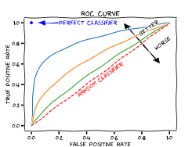

# Regression Classification Metric

## 회귀 / 분류시 알맞은 metric은 무엇일까요?

## Reference

<a href="https://henry1.tistory.com/9">https://henry1.tistory.com/9</a>

<a href="https://nexablue.tistory.com/entry/ML-%EB%B6%84%EB%A5%98Classification%EC%99%80-%ED%9A%8C%EA%B7%80Regression">https://nexablue.tistory.com/entry/ML-%EB%B6%84%EB%A5%98Classification%EC%99%80-%ED%9A%8C%EA%B7%80Regression</a>

### 회귀 (Regression)

* MAE(Mean Apsolute Error): 예측값과 실제값의 차이를 모두 더하여 오차를 계산

    $\frac{\sum{|y-\hat{y}|}}{n}$

* MSE(Mean Squared Error): 예측값과 실제값 사이의 면적

    $\frac{\sum(y-\hat{y})^2}{n}$

MAE 방식이 MSE방식보다 이상치에 민감하지 않다. 왜냐하면 MSE방식은 이상치로 인해 발생한 큰 오차에 제곱을 취하기 때문이다.

* RMSE (Root Mean Sqaured Error)

    $\sqrt{\frac{\sum(y-\hat{y})^2}{n}}$

* MAPE (Mean Absolute Percentage Error)

    $\frac{\sum{|y-\hat{y}|}}{n}\times100(\%)$

* RMSLE (Root Mean Squared Logarithic Error): Target Value가 큰 숫자일 때 발생하는 차이로 인한 penalty를 줄이기 위해 사용

    $\sqrt{\frac{1}{N}\overset{N}{\underset{i=1}{\sum}}(log(y_i+1)-log(\hat{y}_i+1))^2}$

### 분류 (Classification)

#### **분류 일반**

* 정확도(Accuracy)

    $\frac{TP+TN}{TP+FN+FP+TN}$

* 재현률(Recall): 전체 양성샘플 중에 얼마나 많이 양성으로 분류했는가

    i.e) 암진단

    $\frac{TP}{TP+TN}$ 

* 정밀도(Precision): 전체 양성으로 예측된 것 중에 얼마나 실제로 양성이 있는가?

    i.e) 신약개발

    $\frac{TP}{TP+FP}$

* 특이도(Specificity)

    $\frac{TN}{FP+TN}$

* f1-score: 재현률과 정밀도의 조화평균

    $F_1=2\times{\frac{precision\times{recall}}{precision+recall}}$

* ROC-AUC Curve: 진짜 양성비율과 거짓 양성비율을 축으로 한 곡선 아래 영역을 지표로 사용.

    

    TPR: $\frac{TP}{TP+FN}$

    FPR: $\frac{FP}{TN+FP}$

    AUC는 정확도보다 불균형한 데이터셋에서 유리한 지표. AUC를 위해 사용되는 TPR과 FPR의 계산시 서로 다른 행을 사용학 ㅣ때문에 계산시 영향 X.

    즉, FPR이 낮으면서 TPR이 높은 값.

#### **다중 분류**

* f1-score for multiclassification: 한 클래스를 야성으로 두고 나머지를 음성으로 하여 각 클래스마다 f1-score를 계산

    * macro: 클래스의 크기에 상관 없이 같은 비중으로
    * weighted: 클래스 샘플별로 가중치를 부여
    * micro: 모든 클래스의 FP, FN, TP의 수를 헤아린 후, 정밀도, 재현율, f1-score를 차례대로 계산.