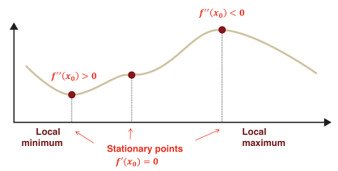

# Local and Global Minima

## Local Minima와 Global Minima에 대해 설명해주세요.

## Reference

<a href="https://hwiyong.tistory.com/9">https://hwiyong.tistory.com/9</a>

임의의 ML문제를 해결함에 있어 예측값과 실제값의 차이를 오차라고 한다. 이 오차를 계산하는데 있어 사용되는 함수를 '손실함수(Loss Function)'이라고 한다.

그리고 이를 모든 input dataset으로 확장하여, 계산한 함수는 '비용함수(Cost Function)'이라고 한다. 

학습의 목표는 비용함수의 point들 중에서 최저값과 매핑되는 point를 찾는 것이다. 그러나 optimal point를 찾아가는 과정에서 최적이라고 의심되지만 실제로 최적이 아닌 지점을 'Local Minima', 실제로 cost function에서 최적인 지점을 'Global Minima'라고 한다. 

국소/최적 최대/최소값을 계산하기 위해서는 Cost function의 $f'(x)=0$인 지점, 즉 정상점을 찾아야 한다. 

정상점이 주어졌을 때,

1. 2차 미분값이 양의 값을 가지면 국부 최소해가 됩니다.

2. 2차 미분값이 음의 값을 가지면 국부 최대해가 됩니다.

3. Hessian 행렬이 positive definite(convex)일 경우, 국소 최솟값이 됩니다.

4. Hessian 행렬이 negative definite(concave)일 경우, 국소 최댓값이 됩니다.

