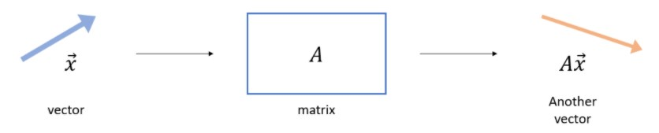
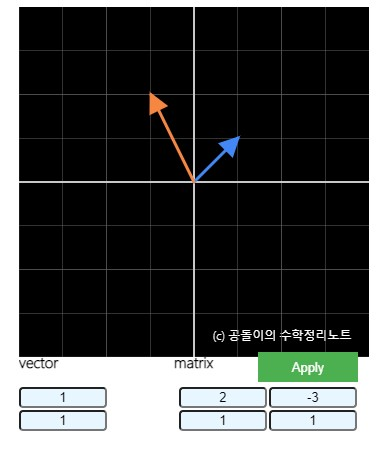
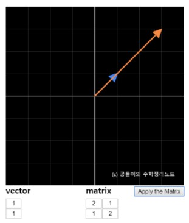
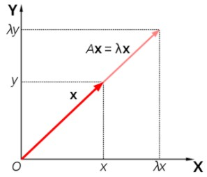

# Eigen-Value-and-Eigen-Vector

## Q. 고유값(eigen value)와 고유벡터(eigen vector)에 대해 설명해주세요. 그리고 왜 중요할까요?

### Reference
* <a href="https://angeloyeo.github.io/2019/07/17/eigen_vector.html">https://angeloyeo.github.io/2019/07/17/eigen_vector.html</a>
* <a href="https://bskyvision.com/669">https://bskyvision.com/669</a>

### 1. 고유값과 고유벡터란?

고유값(eigen value): 임의의 $n\times n$행렬 A에 대하여, 0이 아닌 벡터 $\overset{\rightarrow}{\boldsymbol{x}}$ 가 존재한다면, 숫자 $\lambda$는 행렬 $A$의 고유값이고, $\overset{\rightarrow}{\boldsymbol{x}}$는 고유벡터라고 한다.

$$
A\overrightarrow{x}=\lambda\overrightarrow{x}
$$

이는 행렬이 성질에 의해, $A\overrightarrow{x}-\lambda\overrightarrow{x}=(A-\lambda{I})\overrightarrow{x}=0$에 따라,아래의 두 가지 경우에 의해 영벡터가 된다.

1. $(A-\lambda{I})=0$ 

2. $\overrightarrow{x}=0$ 인 경우에는, 모든 값 $\lambda$에 대해 $\overrightarrow{x}=0$ 이라는 결과를 얻으므로 1번식을 만족할 수 있도록 한다.

$\overrightarrow{x}=0$가 되지 않기 위해서, $(A-\lambda{I})$의 역행렬이 성립되지 않아야 한다고 한다. 왜냐하면, 역행렬이 존재하는 경우 아래의 식과 같아지며, $\overrightarrow{x}=0$이 되기 때문이다.

$$
\overrightarrow{x}=(A-\lambda{I})^{-1}0 = 0
$$

따라서, 위의 식의 경우가 일어나지 않도록 괄호 안의 행렬이 역행렬을 가지지 않도록 한다.

$$
\therefore{det(A-\lambda{I})}=0
$$

### 2. 벡터에 행렬 연산을 취한다는 것은?
행렬은 선형 변환 연산이다. 행렬은 벡터를 변환시켜 다른 벡터를 출력하는데, 아래의 두 그림을 보자.

벡터와 선형 변환

임의의 벡터에 행렬을 곱하게 된 결과는 방향과 크기가 바뀐다는 것을 그림을 통해 알 수 있다.

그렇다면 아래와 같이 특정 벡터와 행렬을 곱하게 되면, 방향은 그대로이며 크기만 달라진 변환 형태를 볼 수 있다. 따라서, 이는 특정 벡터와 특정 행렬의 곱은 특정 벡터에 상수배한 결과값과 같아진다. 이때, 상수배하는 값을 고유값(eigen value)이고, 양변에 곱해진 특정 벡터를 고유벡터(eigen vector)라고 한다.

벡터와 선형변환 2

### 3. 왜 중요한가? (의의)

행렬과 벡터의 연산에 있어서 고유값과 고유벡터를 가진다는 것은 기존의 벡터와 방향은 동일하고 크기만 바뀐다는 것을 의미한다. 그래서, 고유벡터는 방향을 결정하고 고유값은 크기를 결정하는 척도가 된다는 것이다.