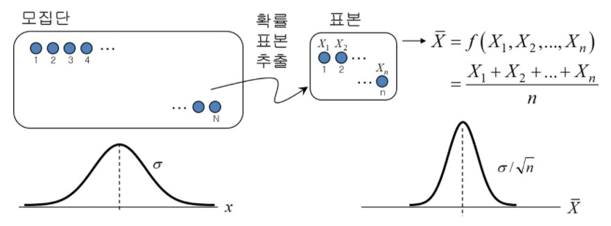
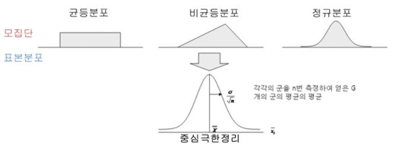

# CLT

## 중심극한정리는 왜 유용한걸까요?

## Referece

<a href="https://drhongdatanote.tistory.com/57">https://drhongdatanote.tistory.com/57</a>

### 중심극한정리(Central Limit Theorem; CLT)

모집단이 평균이 이고, 표준편차가 인 임의의 분포를 이룬다고 할 때, 이 모집단으로 부터 추출된 표본의 크기 n이 충분히 크다면, '표본 평균들이 이루는 분포' **(sampling distribution of sample mean)** 는 평균이 이고 표준편차가 인 정규분포에 근접한다.

### 왜 유용한가?

* 표본 수집을 근거로한 추리통계에서 중요한 이론적인 근거
* 모집단이 어떤 분포를 지니던 간에 표본의 크기가 **'충분히'** 크다면 표본 평균들의 분포가 모집단의 모수를 기반으로한 정규분포를 이루기 때문에 특정 사건(수집단 표본의 평균)이 일어날 확률 값을 계산할 수 있게 된다.

중심극한정리는 표본 평균들이 이루는 표본 분포와 모집단 간의 관계를 증명함으로써, 수집한 통계량을 활용해 모집단의 모수를 추정할 수 있는 수학적인 근거를 마련함.

