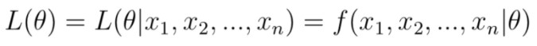

# Likelihood-and-Probabilty

## "likelihood"와 "probability"의 차이는 무엇일까요?

## Reference

<a href="https://dlearner.tistory.com/43">https://dlearner.tistory.com/43</a>

<a href="https://m.blog.naver.com/PostView.nhn?blogId=sw4r&logNo=221361565730&proxyReferer=https:%2F%2Fwww.google.com%2F">https://m.blog.naver.com/PostView.nhn?blogId=sw4r&logNo=221361565730&proxyReferer=https:%2F%2Fwww.google.com%2F</a>

"likelihood"와 'probability'의 차이는 샘플의 수에 따라 달라질 수 있다.

### probabilty(확률)
관측값 또는 관측구간이 **주어진 확률분포 안에서** 얼마만큼 나타날 수 있는가?

### likelihood(가능도)
어떤 특정값을 관찰할 때, 관측치가 어떠한 확률분포에서 나왔는가?

* ): 주어진 파라미터 값을 가지고 랜덤변수 x가 될 확률
* ): x라는 랜덤 변수가 주어졌을 때 파라미터의 확률

### 샘플의 수?

하나의 샘플에 대해서 이야기한다면, 확률과 가능도는 같다.

그러나, 대부분 n개의 샘플 데이터가 있는 상태에서 통계적 분석을 하기 때문에 제대로된 가능도의 형태는 아래와 같다.

둘의 수식이 같은 이유는 하나의 샘플에 대해서만 살펴보면 확률과 가능도는 동일하기 때문이다. 

왜 '곱셈'을 수행하는 것일까?

각각의 샘플들의 확률에 대해 함께 일어날 확률이 가능도가 되기 때문이다. 보통 샘플들을 취급할 때 독립성을 가정하기 때문에 함께 일어나는 확률은 곱셈으로 대체하기 때문이다.

### 요약

확률: 고정된 확률분포에서 어떠한 관측값이 나타나는지에 대한 확률

우도: 고정된 관측값이 어떤 확률분포에서 어느정도의 확률로 나타나는지에 대한 확률