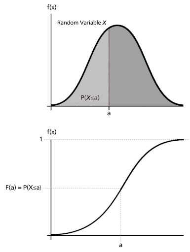

# CDF-and-PDF

## Q. 누적분포함수와 확률밀도함수는 무엇일까요? 수식과 함께 표현해주세요

## Reference
<a href="https://iludaslab.tistory.com/10">https://iludaslab.tistory.com/10</a>

### 누적분포함수(Cumulative Distribution Function; CDF)
누적분포함수는 어떤 확률 분포에 대해서 확률 변수가 특정값보다 작거나 같은 확률을 나타낸다.

### 확률밀도함수(Probaility Density Function; PDF)
연속적인 변수에 대한 확률분포함수를 의미한다. 특정 확률 변수 구간의 확률이 다른 확률 변수 구간에 비해 상대적으로 얼마나 높은지를 의미한다.

확률 밀도 함수의 경우 아래 두가지 특징을 가진다.

1. \geq{0})
2. =1)

CDF와 PDF

