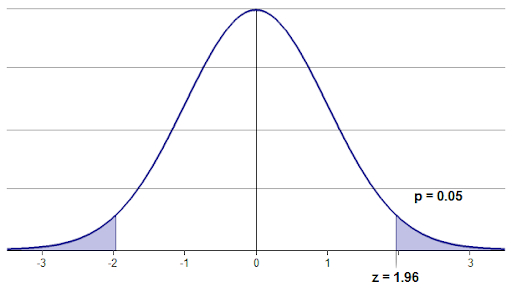

# p-value

## p-value를 고객에게는 뭐라고 설명하는게 이해하기 편할까요?

## Reference

<a href="https://adnoctum.tistory.com/332">https://adnoctum.tistory.com/332</a>

### p-value

p-value는 모집단에서 추출한 분포의 평균과 모집단의 분포의 평균이 얼마나 다른 값인지를 얻기위한 지표.

Figure. p-value

귀무가설(H0)가 맞다는 전제하에, **관측된 통계값 혹은 그 값보다 더 큰값(극단적인 데이터가 나올 확률)**이 나올 확률. 다시 말해, 샘플링을 통해 얻은 분포의 통계량 값이 실제 모집단에서 나타날 확률.

따라서, p-value가 낮을 수록 귀무가설과 데이터가 불일치할 확률이 높아서 대립가설을 채택함. 그러나, p-value가 대립가설을 채택할 확률을 나타내지는 않는다.

## p-value는 요즘 시대에도 여전히 유효할까요? 언제 p-value가 실제를 호도하는 경향이 있을까요?

## Reference

<a href="https://m.blog.naver.com/PostView.nhn?blogId=youji4ever&logNo=221509677731&proxyReferer=https:%2F%2Fwww.google.com%2F">https://m.blog.naver.com/PostView.nhn?blogId=youji4ever&logNo=221509677731&proxyReferer=https:%2F%2Fwww.google.com%2F</a>

### p-value가 사실을 호도하는 경우

1. p-value보다 유의성만 보고하는 오류 (w/ 신뢰구간 정의)

    가설 검정 시, 유의수준 (1%, 5%, 10%)를 정해두고 계산된 p-value가 보다 작으면 유의수준 에서 통계적으로 유의하다는 결론을 내리고, 크면 그렇지 않다고 판단.

2. p-value를 모수에 대한 확률로만 이해하는 경우
    (misleading from, p-value = 귀무가설이 채택/기각될 확률)

    2.1. 높은 p-value가 귀무가설이 옳다는 증거로 이해하는 오류

    : 높은 p-value를 가진다는 것은, 대립가설을 입증하는 증거가 불충분하다고 이해해야 한다. 

    2.2. 낮은 p-value가 항상 의미있는가?
    (낮은 p-value는 대립가설에 대한 증거나 효과를 입증하는가?)

    : 수학적으로 그럴 수 있지만, 실제로는 아닐 수 있다.

    i.e. 표본의 크기가 충분히 크다면 낮은 p-value를 얻을 수 있다.

따라서, 통계적 유의성 != 실용적 유의성 -> p-value를 맹신해서는 안된다.